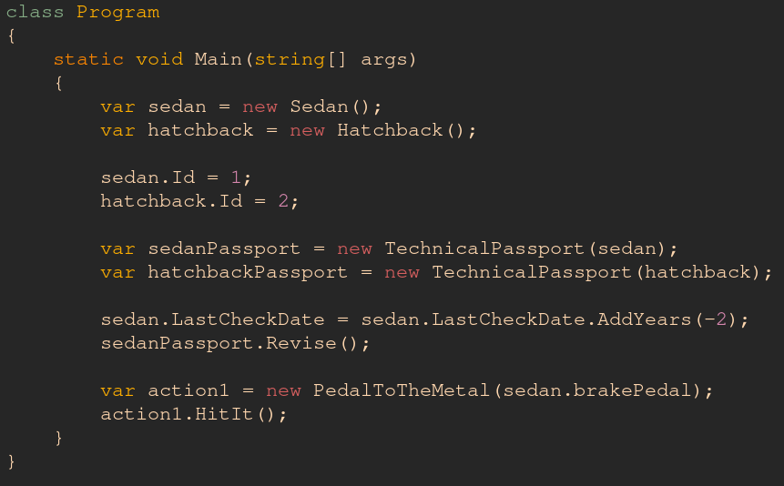
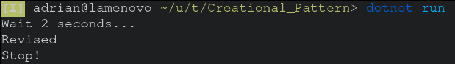

# Laboratory work nr. 2
-----
# Topic: *Structural Design Patterns*
### Author: *Adrian Covaci*
-----
## Objectives:
1. Study and understand the Structural Design Patterns;
2. Try to implement to the previous laboratory work some of those patterns;
3. Based on the previous point, implement atleast 3 structural design patterns in project;

## Description & Implementation

Firstly, I used the [Decorator](https://sourcemaking.com/design_patterns/decorator) to attach new feautures to add new components to the already existent Car type.
Here is the exemple of implementation of the base Decorator class:  

IPedal.cs:
~~~
    public interface IPedal
    {
        void Push();
    }
~~~
ICar.cs:
~~~
    public interface ICar : ICloneable, ITechnicalRevision
    {
        int Id { get; set; }
        DateTime LastCheckDate { get; set; }
        BrakePedal brakePedal { get; set; }
        GasPedal gasPedal { get; set; }
        void Honk();
    }
~~~
This allows me to attach new behaviours (*pedals*) to a car, meaning that I can change the behavior of a car at runtime, by using methods of a referenced class.

Secondly, I've used the [Bridge](https://sourcemaking.com/design_patterns/bridge) to split car components  into two separate hierarchies - abstraction and implementation, to have the posibility to independently develop them. 

DriverAction.cs: (*Abstraction*)
~~~
    public class PedalToTheMetal
    {
        protected IPedal pedal;
        public PedalToTheMetal(IPedal pedal)
        {
            this.pedal = pedal;
        }
        public void HitIt()
        {
            pedal.Push();
        }
    }
~~~
IPedal.cs (*Implementation*):
~~~    
    public interface IPedal
    {
        void Push();
    }
~~~
SedanCar.cs (*Concrete Implementation*)
~~~
    public class Sedan : ICar
    {
        public int Id { get; set; }
        public DateTime LastCheckDate { get; set; } = DateTime.Now;
        public BrakePedal brakePedal { get; set; } = new BrakePedal();
        public GasPedal gasPedal { get; set; } = new GasPedal();
        public Sedan() { }
        ...
    }
~~~
Program.cs:
~~~
        var action1 = new PedalToTheMetal(sedan.brakePedal);
        action1.HitIt();
~~~
Finally, I've used the [Proxy](https://sourcemaking.com/design_patterns/proxy) in the implementation of the TechnicalPassport class. Based on the date of a car's last revision, we could either call car's *revise* method, which for simplicity reasons, contains a `Thread.Sleep` method, to mock heavyweight operations, or we could continue with the *TechnicalPassport*'s method
ITechnicalRevision.cs:
~~~
    public interface ITechnicalRevision
    {
        void Revise();
    }
~~~
SedanCar.cs Revise Method:
~~~
        public void Revise()
        {
            System.Threading.Thread.Sleep(2000);
            LastCheckDate = DateTime.Now;
            Console.WriteLine("Revised");
        }
~~~
TechnicalPassport.cs:
~~~
    public class TechnicalPassport : ITechnicalRevision
    {
        public ICar car;
        public TechnicalPassport(ICar car)
        {
            this.car = car;
        }
        public void Revise()
        {
            if ((DateTime.Now - car.LastCheckDate).Days >= 365.25)
            {
                car.Revise();
            }
            else
            {
                Console.WriteLine(car.Id);
            }
        }

    }
~~~
## Screenshot

