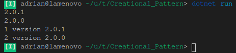

# Laboratory work nr. 3
-----
# Topic: *Behavioral Design Patterns*
### Author: *Adrian Covaci*
-----
## Objectives:
1. Study and understand the Behavioral Design Patterns;
2. Try to implement to the previous laboratory work some of those patterns;

## Description & Implementation

Firstly, I've used the [Observer](https://sourcemaking.com/design_patterns/observer) to mock the newly added class `Hq` to update the software version for all of it's observers (ICar type, in this case).
Here is the example of the Subject class:  

IHq.cs:
~~~
    public interface IHq
    {
        void Attach(ICar car);
        void Detach(ICar car);
        void NotifySoftwareUpdate();
    }
~~~
ICar.cs:
~~~
    public interface ICar : ICloneable, ITechnicalRevision
    {
        ...
        void SoftwareUpdate(IHq hq);
    }
~~~
This allows me to attach/detach new observers to a concrete implementation of an Hq, meaning that I can push/pull changes by using methods of the referenced class.

Secondly, I've used the [Iterator](https://sourcemaking.com/design_patterns/iterator) to iterate through cars collections. 

Iterator.cs: (*Abstraction*)
~~~
    public abstract class Iterator : IEnumerator
    {
        object IEnumerator.Current => Current();
        public abstract int Key();
        public abstract object Current();
        public abstract bool MoveNext();
        public abstract void Reset();
    }
~~~
IteratorAggregate.cs: (*Abstraction*)
~~~
    public abstract class IteratorAggregate : IEnumerable
    {
        public abstract IEnumerator GetEnumerator();
    }
~~~
IdIterator.cs (*Implementation*):
~~~    
    public class IdIterator : Iterator
    {
        private CarsCollection cars;
        private int position = -1;

        public IdIterator(CarsCollection cars)
        {
            this.cars = cars;
        }
        public override object Current()
        {
            return this.cars.GetItems()[position];
        }

        public override int Key()
        {
            return this.position;
        }

        public override bool MoveNext()
        {
            int updatedPosition = this.position + 1;
            if (updatedPosition >= 0 && updatedPosition < this.cars.GetItems().Count)
            {
                this.position = updatedPosition;
                return true;
            }
            else
            {
                return false;
            }
        }

        public override void Reset()
        {
            this.position = 0;
        }
    }
~~~
CarsCollection.cs (*Concrete Implementation*)
~~~
    public class CarsCollection : IteratorAggregate
    {
        List<ICar> cars = new List<ICar>();

        public List<ICar> GetItems()
        {
            return cars;
        }

        public void AddCar(ICar car)
        {
            cars.Add(car);
        }

        public override IEnumerator GetEnumerator()
        {
            return new IdIterator(this);
        }
    }
~~~
Program.cs:
~~~
    ...
        var teslaHQ = new TeslaHq();
        teslaHQ.Attach(sedan);
        teslaHQ.Attach(hatchback);

        //2.0.0
        teslaHQ.MajorUpgrade();
        teslaHQ.NotifySoftwareUpdate();
        teslaHQ.Detach(hatchback);

        //2.0.1
        teslaHQ.PatchUpdate();
        teslaHQ.NotifySoftwareUpdate();

        var cars = new CarsCollection();
        cars.AddCar(sedan);
        cars.AddCar(hatchback);

        foreach (var car in cars)
        {
            System.Console.WriteLine(car.ToString());
        }
    ...
~~~
## Screenshot

