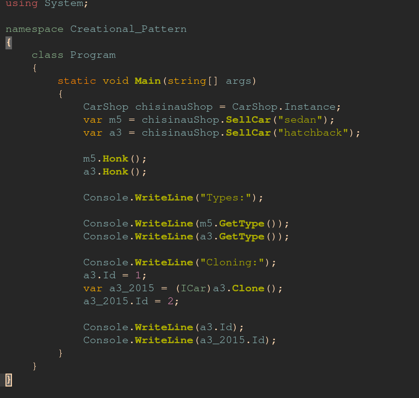
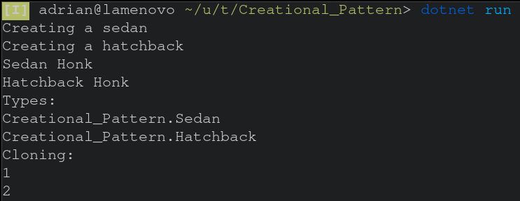

# Topic: *Creational Design Patterns*
### Author: *Adrian-Mihai Covaci*
------
## Objectives :
__1. Study the Creational Design Patterns__

__2. Implement them in real projects__

## Theory :
Creational patterns provide various object creation mechanisms, which increase flexibility and reuse of existing code.

Some examples of this kind of design patterns are :

   * Singleton
   * Builder
   * Prototype
   * Object Pooling
   * Factory Method
   * Abstract Factory

## Implementation :
In the following project, I've implemented a factory which deals with creating cars based on the body type that the client requested.
Besides using the factory, a car can be created by cloning an already existent one. It is guaranteed that only one instance of a car shop can be created, and the creation process is thread safe, using .NET's Lazy<T> type, by accessing the object's `Instance` property.

Singleton dp:
~~~
private static readonly Lazy<CarShop> carShop = new Lazy<CarShop>(() => new CarShop(), true);
private int carsSold;
public static CarShop Instance { get { return carShop.Value; } }

private CarShop()
{
    carsSold = 0;
}
~~~

The `clone` method is performing a deep copy of the object and returns a car interface:

Prototype dp:
~~~
public object Clone()
{
    var cloned = (Sedan)this.MemberwiseClone();
    return cloned; 
}
~~~
Abstract Factory dp:
~~~
CarShop chisinauShop = CarShop.Instance;
var m5 = chisinauShop.SellCar("sedan");
var a3 = chisinauShop.SellCar("hatchback");
~~~
Instead of creating different factories to manage the creation process, the factory creates objects based on the type input that it gets. This is mainly due to the simplicity of the project.
~~~
public static ICar CreateCar(string type)
~~~
~~~
public sealed class CarShop
{
    private static readonly Lazy<CarShop> carShop = new Lazy<CarShop>(() => new CarShop(), true);
    private int carsSold;
    public static CarShop Instance { get { return carShop.Value; } }

    private CarShop()
    {
        carsSold = 0;
    }

    public ICar SellCar(string type)
    {
        carsSold++;
        return CarFactory.CreateCar(type);
    }
}
~~~

## Screenshot

